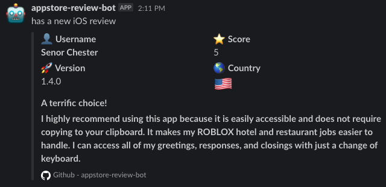

# appstore-review-bot
🤖 Easy forward appstore reviews to slack channel using webhook  

# Usage 
- `fork` repository.
- go to `Settings` - `Secrets` - `Add a new secret` 
- Input your slack webhook name `WEBHOOKS`
- `src/config.json` - change `appId` , `country` for your apps.
- Done 🎉

# Contribution 
- Feel free to contribution for this project. 
